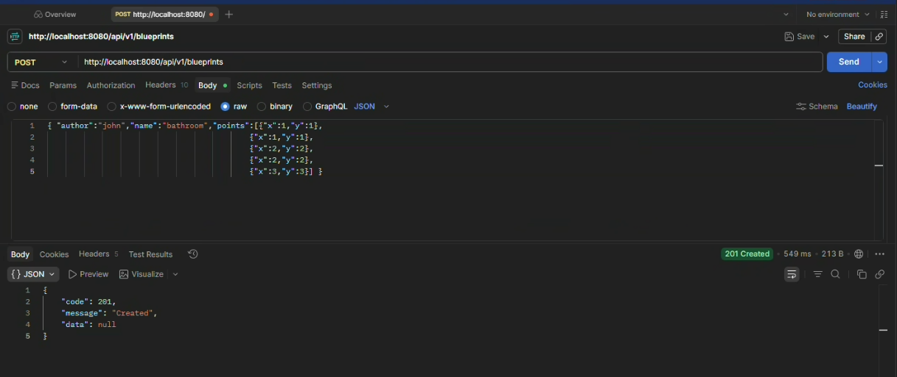
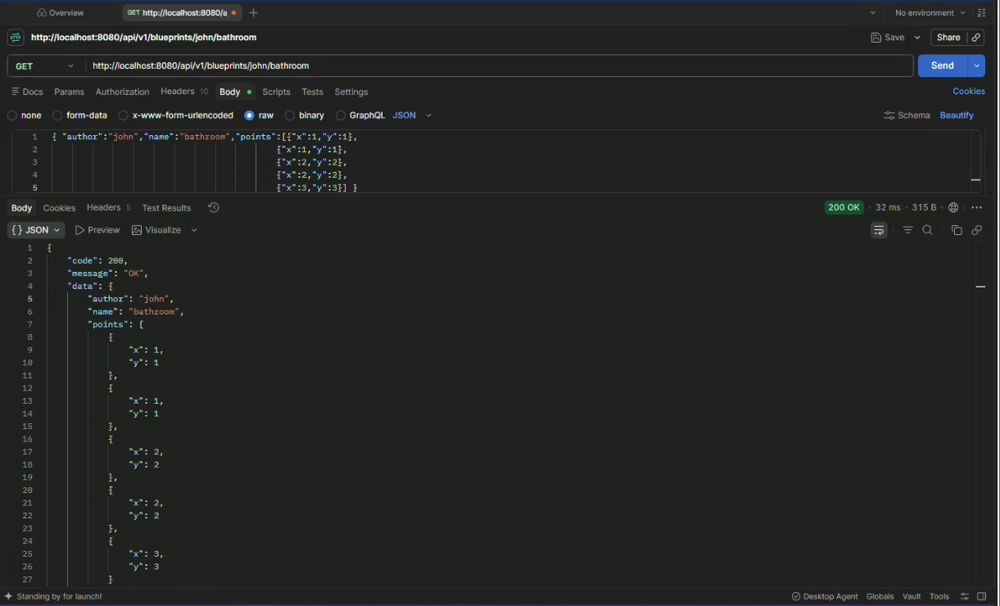
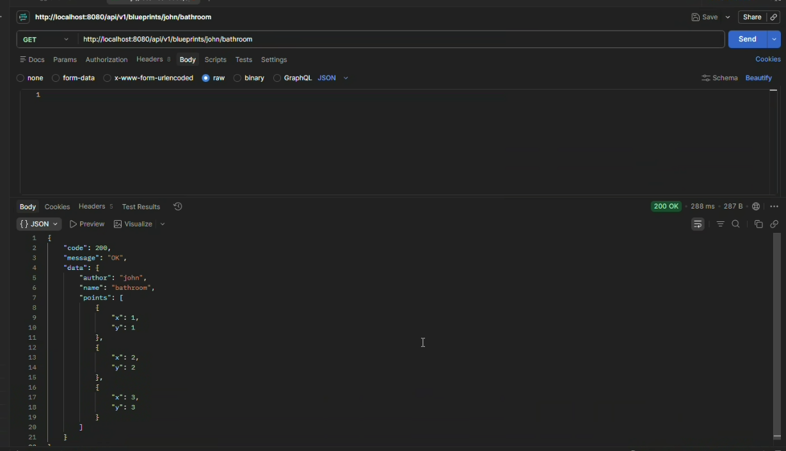
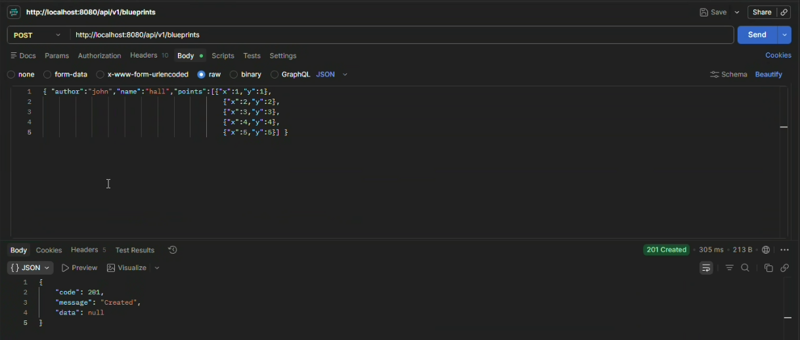
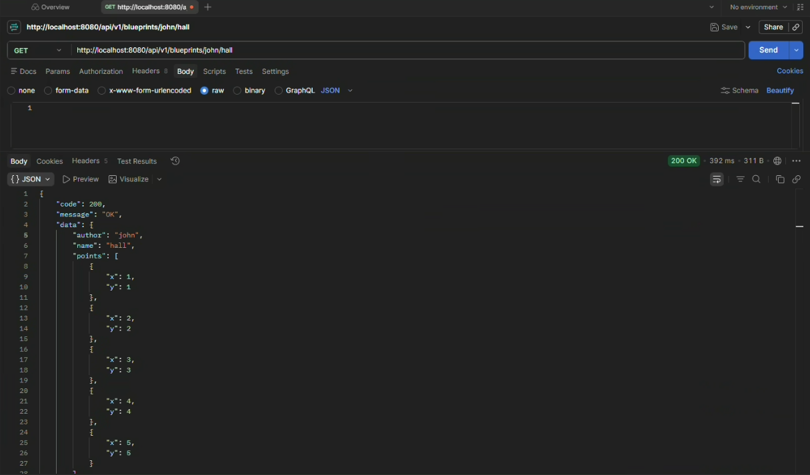
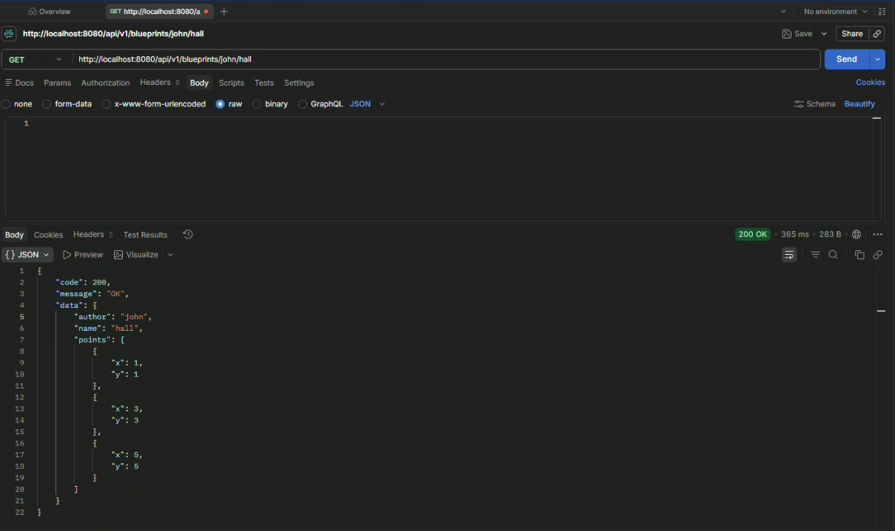

# 5. Filtros de Blueprints

Los filtros permiten modificar los puntos de un blueprint antes de enviarlos
en la respuesta. Se implementaron las siguientes opciones:

| Filtro | Funcion |
| --- | --- |
| `IdentityFilter` | Devuelve los puntos sin cambios. |
| `RedundancyFilter` | Elimina puntos duplicados consecutivos. |
| `UndersamplingFilter` | Conserva uno de cada dos puntos. |

Todos implementan la interfaz `BlueprintsFilter`. El servicio utiliza el
filtro seleccionado sin modificar la logica del controlador.

## Perfiles de Spring

La seleccion se realiza mediante perfiles:

| Perfil | Filtro |
| --- | --- |
| Ninguno | `IdentityFilter` |
| `redundancy` | `RedundancyFilter` |
| `undersampling` | `UndersamplingFilter` |

El filtro se aplica al consultar un blueprint especifico mediante `GET /api/v1/blueprints/{author}/{bpname}`

La informacion original permanece guardada en PostgreSQL.

## Prueba

Primero iniciar la base de datos y la aplicacion:

```
docker-compose up -d
mvn spring-boot:run
```

En Postman crear un blueprint con `POST` usando la URL:`http://localhost:8080/api/v1/blueprints`

Luego consultar:

```
GET http://localhost:8080/api/v1/blueprints/john/filter-test
```

Para comparar los filtros, detener la aplicacion y ejecutarla con uno de
estos perfiles:

```
mvn spring-boot:run -Dspring-boot.run.profiles=redundancy
mvn spring-boot:run -Dspring-boot.run.profiles=undersampling
```

Con `redundancy` deben desaparecer los duplicados consecutivos. Con
`undersampling` deben aparecer los puntos de las posiciones `0`, `2`, `4`,
etc. En ambos casos la respuesta debe ser `200 OK` y los datos originales de
la base de datos no deben modificarse.


**Prueba**:

#### redundancy

Antes del filtro

`mvn spring-boot:run` 






Despues del filtro

mvn spring-boot:run -Dspring-boot.run.profiles=redundancy

solo se hace el `GET` porque ya esta creado



---

#### undersampling

Antes del filtro

`mvn spring-boot:run` 





Despues del filtro

`mvn spring-boot:run -Dspring-boot.run.profiles=undersampling`

